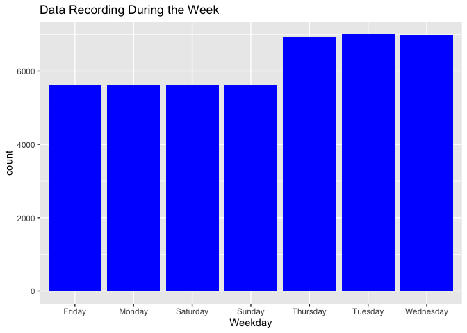
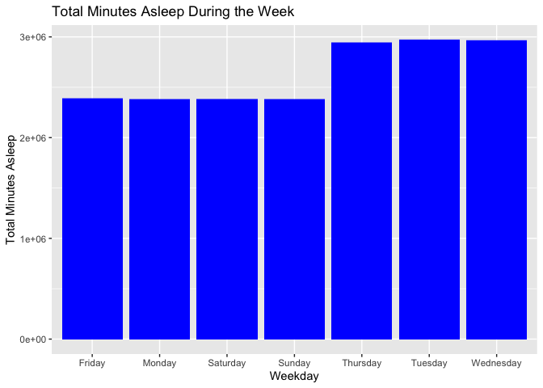
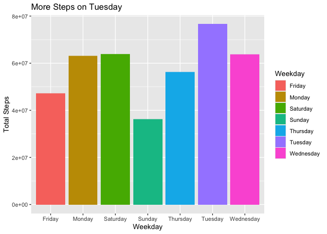
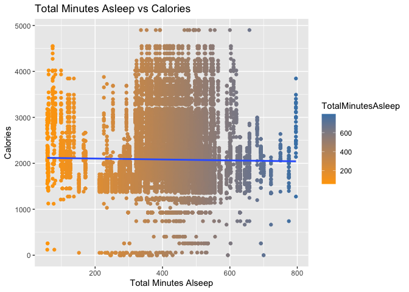

Bellabeat Fitness Data Analysis
================

#### Author : Karan Arora

#### Date : 1 August 2024

# The case study consists of six steps of the data analysis process:

### ❓ [Ask](#Ask)

### 💻 [Prepare](#Prepare)

### 🛠 [Process](#Process)

### 📊 [Analyze](#Analyze)

### 📋 [Share](#Share)

### 🧗 [Act](#Act)

## Scenario

Founded in 2014, Bellabeat is the company that developed one of the
first wearables specifically designed for women and has since gone on to
create a portfolio of digital products for tracking and improving the
health of women.

Focusing on creating innovative health and wellness products for women,
their mission is to empower women to take control of their health by
providing them with technology-driven solutions that blend design and
function.

## 1. Ask

💡 **BUSINESS TASK : Analyze Fitbit data to gain insight and help guide
marketing strategy for Bellabeat to grow as a global player.**

Primary stakeholders: Urška Sršen and Sando Mur, executive team members.

Secondary stakeholders: Bellabeat marketing analytics team.

## 2. Prepare

🗄️ **DATA SOURCE : 30 participants FitBit Fitness Tracker Data from
Mobius: <https://www.kaggle.com/arashnic/fitbit>**

The dataset has 18 CSV. The data also follow a ROCCC approach:

- Reliability: The data is from 30 FitBit users who consented to the
  submission of personal tracker data and generated by from a
  distributed survey via Amazon Mechanical Turk.
- Original: The data is from 30 FitBit users who consented to the
  submission of personal tracker data via Amazon Mechanical Turk.
- Comprehensive: Data minute-level output for physical activity, heart
  rate, and sleep monitoring. While the data tracks many factors in the
  user activity and sleep, but the sample size is small and most data is
  recorded during certain days of the week.
- Current: Data is from March 2016 to May 2016. Data is not current so
  the users habit may be different now.
- Cited: Unknown.

⚠️ **The data set has limitations:**

- Only 30 user data is available. The central limit theorem general rule
  of n≥30 applies and we can use the t test for statstic reference.
  However, a larger sample size is preferred for the analysis.
- Upon further investigation with `n_distinct()` to check for unique
  user Id, the set has 33 user data from daily activity, 24 from sleep
  and only 8 from weight. There are 3 extra users and some users did not
  record their data for tracking daily activity and sleep.
- For the 8 user data for weight, 5 users manually entered their weight
  and 3 recorded via a connected wifi device (eg: wifi scale).
- Most data is recorded from Tuesday to Thursday, which may not be
  comprehensive enough to form an accurate analysis.

Importing the 3 CSVs : daily_activity, sleep, weight into R using
`read.csv`.

``` r
daily_activity <- read.csv("/Users/karanarora/Documents/Learning/Projects/Bellabeat/dailyActivity_merged.csv")
sleep_day <- read.csv("/Users/karanarora/Documents/Learning/Projects/Bellabeat/sleepDay_merged.csv")
weight <-read.csv("/Users/karanarora/Documents/Learning/Projects/Bellabeat/weightLogInfo_merged.csv")
```

## 3. Process

Examining the three tables (daily_activity,sleep,weight) for any
duplicates or null values :

``` r
sum(is.na(daily_activity))
```

    ## [1] 0

``` r
sum(is.na(sleep_day))
```

    ## [1] 0

``` r
sum(is.na(weight))
```

    ## [1] 65

``` r
sum(duplicated(daily_activity))
```

    ## [1] 0

``` r
sum(duplicated(sleep_day))
```

    ## [1] 3

``` r
sum(duplicated(weight))
```

    ## [1] 0

Removing the 3 duplicates from sleep_day :

``` r
sleep_day <- sleep_day[!duplicated(sleep_day), ]
sum(duplicated(sleep_day))
```

    ## [1] 0

Convert ActivityDate into date format and add column for the weekday :

``` r
daily_activity <- daily_activity %>% 
  mutate( Weekday = weekdays(as.Date(ActivityDate,"%m/%d/%Y")))
```

Checking to see if we have 30 users using `n_distinct`. The data set has
33 users from daily_activity, 24 from sleep and only 8 from weight. If
there is a discrepency such as in the weight table, checking to see how
the data are recorded. The way the user record the data may give us
insight on why there is missing data.

``` r
weight %>% 
  filter(IsManualReport == "TRUE") %>% 
  group_by(Id) %>% 
  summarise("Manual Weight Report" = n()) %>% 
  distinct()
```

    ## # A tibble: 0 × 2
    ## # ℹ 2 variables: Id <dbl>, Manual Weight Report <int>

Merging the 3 data tables :

``` r
merged1 <- merge(daily_activity,sleep_day,by = c("Id"), all=TRUE)
merged_data <- merge(merged1,weight,by = c("Id"), all = TRUE)
```

Checking how often users record their data. We can see most of the users
record their data from Tuesday to Thursday using `ggplot`. We need to
ask why the users are not recording their data on Mondays or Fridays?

``` r
ggplot(data=merged_data, aes(x= Weekday)) + geom_bar(fill = "blue") +
  labs(title = "Data Recording During the Week")
```

<!-- -->

⛔ From weekday’s total asleep minutes, we can see the graph look almost
**same** as the graph above! We can confirmed that most sleep data is
also recorded during Tuesday to Thursday. This raised a question “how
comprehensive are the data to form an accurate analysis?”

``` r
ggplot(data = merged_data,aes(x = Weekday,y = TotalMinutesAsleep, fill = Weekday))+
  geom_bar(stat="identity",fill="blue")+
  labs(title = "Total Minutes Asleep During the Week", y = "Total Minutes Asleep")
```

<!-- -->

## 4. Analyze

### Summary

Check min, max, mean, median and any outliers. Avg weight is 135 pounds
with BMI of 24 and burn 2050 calories. Avg steps is 10200, max is almost
triple that 36000 steps. Users spend on avg 12 hours a day in sedentary
minutes, 4 hours lightly active, only half hour in fairly+very active!
Users also gets about 7 hour of sleep.

``` r
merged_data %>% 
  select(TotalSteps,
         TotalDistance,
         VeryActiveMinutes,
         FairlyActiveMinutes,
         LightlyActiveMinutes,
         SedentaryMinutes,
         Calories,
         TotalSleepRecords,
         TotalMinutesAsleep,
         TotalTimeInBed,
         WeightPounds,
         BMI) %>% 
  summary()
```

    ##    TotalSteps    TotalDistance    VeryActiveMinutes FairlyActiveMinutes
    ##  Min.   :    0   Min.   : 0.000   Min.   :  0.00    Min.   :  0.00     
    ##  1st Qu.: 5832   1st Qu.: 3.910   1st Qu.:  0.00    1st Qu.:  3.00     
    ##  Median :10199   Median : 6.820   Median : 15.00    Median : 14.00     
    ##  Mean   : 9373   Mean   : 6.415   Mean   : 23.57    Mean   : 17.82     
    ##  3rd Qu.:12109   3rd Qu.: 8.350   3rd Qu.: 38.00    3rd Qu.: 31.00     
    ##  Max.   :36019   Max.   :28.030   Max.   :210.00    Max.   :143.00     
    ##                                                                        
    ##  LightlyActiveMinutes SedentaryMinutes    Calories    TotalSleepRecords
    ##  Min.   :  0.0        Min.   :   0.0   Min.   :   0   Min.   :1.000    
    ##  1st Qu.:194.0        1st Qu.: 637.0   1st Qu.:1850   1st Qu.:1.000    
    ##  Median :238.0        Median : 697.0   Median :2046   Median :1.000    
    ##  Mean   :232.2        Mean   : 722.6   Mean   :2103   Mean   :1.101    
    ##  3rd Qu.:288.0        3rd Qu.: 745.0   3rd Qu.:2182   3rd Qu.:1.000    
    ##  Max.   :518.0        Max.   :1440.0   Max.   :4900   Max.   :3.000    
    ##                                                       NA's   :971      
    ##  TotalMinutesAsleep TotalTimeInBed   WeightPounds        BMI       
    ##  Min.   : 58.0      Min.   : 61.0   Min.   :116.0   Min.   :21.45  
    ##  1st Qu.:400.0      1st Qu.:421.0   1st Qu.:134.9   1st Qu.:23.89  
    ##  Median :442.0      Median :457.0   Median :135.6   Median :24.00  
    ##  Mean   :433.8      Mean   :458.2   Mean   :139.6   Mean   :24.42  
    ##  3rd Qu.:477.0      3rd Qu.:510.0   3rd Qu.:136.7   3rd Qu.:24.21  
    ##  Max.   :796.0      Max.   :961.0   Max.   :294.3   Max.   :47.54  
    ##  NA's   :971        NA's   :971     NA's   :8881    NA's   :8881

### Active minutes

``` r
total_minutes <- sum(daily_activity$SedentaryMinutes, daily_activity$VeryActiveMinutes,
                     daily_activity$FairlyActiveMinutes, daily_activity$LightlyActiveMinutes)
sedentary_percentage <- sum(daily_activity$SedentaryMinutes)/total_minutes*100
lightly_percentage <- sum(daily_activity$LightlyActiveMinutes)/total_minutes*100
fairly_percentage <- sum(daily_activity$FairlyActiveMinutes)/total_minutes*100
active_percentage <- sum(daily_activity$VeryActiveMinutes)/total_minutes*100

percentage <- data.frame(
  level = c("Sedentary", "Lightly", "Fairly", "Active"),
  minutes = c(sedentary_percentage,lightly_percentage,fairly_percentage,active_percentage)
)

plot_ly(percentage, labels = ~level, values = ~minutes, type = 'pie',textposition = 'outside',textinfo = 'label+percent') %>%
  layout(title = 'Activity Level Minutes',
         xaxis = list(showgrid = FALSE, zeroline = FALSE, showticklabels = FALSE),
         yaxis = list(showgrid = FALSE, zeroline = FALSE, showticklabels = FALSE))
```

<div class="plotly html-widget html-fill-item" id="htmlwidget-64cdff95d5cba8de232a" style="width:672px;height:480px;"></div>
<script type="application/json" data-for="htmlwidget-64cdff95d5cba8de232a">{"x":{"visdat":{"b5332e11a66":["function () ","plotlyVisDat"]},"cur_data":"b5332e11a66","attrs":{"b5332e11a66":{"labels":{},"values":{},"textposition":"outside","textinfo":"label+percent","alpha_stroke":1,"sizes":[10,100],"spans":[1,20],"type":"pie"}},"layout":{"margin":{"b":40,"l":60,"t":25,"r":10},"title":"Activity Level Minutes","xaxis":{"showgrid":false,"zeroline":false,"showticklabels":false},"yaxis":{"showgrid":false,"zeroline":false,"showticklabels":false},"hovermode":"closest","showlegend":true},"source":"A","config":{"modeBarButtonsToAdd":["hoverclosest","hovercompare"],"showSendToCloud":false},"data":[{"labels":["Sedentary","Lightly","Fairly","Active"],"values":[81.329890680046219,15.820493214202166,1.1130139975629088,1.7366021081886964],"textposition":["outside","outside","outside","outside"],"textinfo":"label+percent","type":"pie","marker":{"color":"rgba(31,119,180,1)","line":{"color":"rgba(255,255,255,1)"}},"frame":null}],"highlight":{"on":"plotly_click","persistent":false,"dynamic":false,"selectize":false,"opacityDim":0.20000000000000001,"selected":{"opacity":1},"debounce":0},"shinyEvents":["plotly_hover","plotly_click","plotly_selected","plotly_relayout","plotly_brushed","plotly_brushing","plotly_clickannotation","plotly_doubleclick","plotly_deselect","plotly_afterplot","plotly_sunburstclick"],"base_url":"https://plot.ly"},"evals":[],"jsHooks":[]}</script>

The American Heart Association and World Health Organization recommend
at least 150 minutes of moderate-intensity activity or 75 minutes of
vigorous activity, or a combination of both, each week. That means it
needs an daily goal of 21.4 minutes of FairlyActiveMinutes or 10.7
minutes of VeryActiveMinutes.

In our dataset, **30 users** met fairly active minutes or very active
minutes.

``` r
active_users <- daily_activity %>% 
  filter(FairlyActiveMinutes >= 21.4 | VeryActiveMinutes>= 10.7) %>% 
  group_by(Id) %>% 
  count(Id)

active_users
```

    ## # A tibble: 30 × 2
    ## # Groups:   Id [30]
    ##            Id     n
    ##         <dbl> <int>
    ##  1 1503960366    30
    ##  2 1624580081     6
    ##  3 1644430081    16
    ##  4 1927972279     2
    ##  5 2022484408    28
    ##  6 2320127002     2
    ##  7 2347167796    12
    ##  8 2873212765    11
    ##  9 3372868164    11
    ## 10 3977333714    27
    ## # ℹ 20 more rows

### Noticeable day

The bar graph shows that there is a jump on Tuesday: user spent LESS
time in sedentary minutes and take MORE steps. Users are out and about
on Tuesday.

``` r
ggplot(data = merged_data,aes(x = Weekday,y = TotalSteps, fill = Weekday))+
  geom_bar(stat="identity")+
  labs(title = "More Steps on Tuesday", y = "Total Steps")
```

<!-- -->

### Interesting finds

The more active that you’re, the more steps you take, and the more
calories you will burn. This is an obvious fact, but we can still look
into the data to find any interesting. Here we see that some users who
are sedentary, take minimal steps, but still able to burn over 1500 to
2500 calories compare to users who are more active, take more steps, but
still burn similar calories.


### Sleep

According to article: [Fitbit Sleep
Study](https://blog.fitbit.com/sleep-study/#:~:text=The%20average%20Fitbit%20user%20is,is%20spent%20restless%20or%20awake.&text=People%20who%20sleep%205%20hours,the%20beginning%20of%20the%20night.),
55 minutes are spent awake in bed before going to sleep. We have 13
users in our dataset spend 55 minutes awake before alseep.

``` r
sleep_day_in_hour <-sleep_day
sleep_day_in_hour$TotalMinutesAsleep <- sleep_day_in_hour$TotalMinutesAsleep/60
sleep_day_in_hour$TotalTimeInBed <- sleep_day_in_hour$TotalTimeInBed/60
head(sleep_day_in_hour)
```

    ##           Id              SleepDay TotalSleepRecords TotalMinutesAsleep
    ## 1 1503960366 4/12/2016 12:00:00 AM                 1           5.450000
    ## 2 1503960366 4/13/2016 12:00:00 AM                 2           6.400000
    ## 3 1503960366 4/15/2016 12:00:00 AM                 1           6.866667
    ## 4 1503960366 4/16/2016 12:00:00 AM                 2           5.666667
    ## 5 1503960366 4/17/2016 12:00:00 AM                 1          11.666667
    ## 6 1503960366 4/19/2016 12:00:00 AM                 1           5.066667
    ##   TotalTimeInBed
    ## 1       5.766667
    ## 2       6.783333
    ## 3       7.366667
    ## 4       6.116667
    ## 5      11.866667
    ## 6       5.333333

13 users spend more than 55 minutes in bed before falling asleep :

``` r
awake_in_bed <- mutate(sleep_day, AwakeTime = TotalTimeInBed - TotalMinutesAsleep)
awake_in_bed <- awake_in_bed %>% 
  filter(AwakeTime >= 55) %>% 
  group_by(Id) %>% 
  arrange(AwakeTime, desc=TRUE) 

n_distinct(awake_in_bed$Id) 
```

    ## [1] 13

Majority of the users sleep between 5 to 10 hours burns around 1500 to
4500 calories a day.

<!-- -->

### 6. Share

🎨 [Bellabeat Data Presentation in
Tableau](https://public.tableau.com/app/profile/karan.arora8884/viz/Bellabeat-KaranArora/Story1)


### 7. Act

Conclusion based on our analysis:

Sedentary make up a significant portion, 81% of users daily active
minutes. Users spend on avg 12 hours a day in sedentary minutes, 4 hours
lightly active, and only half-hour in fairly+very active! We see the
most change on Saturday: users take more steps, burn more calories, and
spend less time sedentary. Sunday is the most “lazy” day for users. 54%
of the users who recorded their sleep data spent 55 minutes awake in bed
before falling asleep. Users takes the most steps from 5 PM to 7 PM
Users who are sedentary take minimal steps and burn 1500 to 2500
calories compared to users who are more active, take more steps, but
still burn similar calories. Marketing recommendations to expand
globally:

🔢 Obtain more data for an accurate analysis, encouraging users to use a
wifi-connected scale instead of manual weight entries.

🚲 Educational healthy style campaign encourages users to have short
active exercises during the week, longer during the weekends, especially
on Sunday where we see the lowest steps and most sedentary minutes.

🎁 Educational healthy style campaign can pair with a point-award
incentive system. Users completing the whole week’s exercise will
receive Bellabeat points on products/memberships.

🏃‍♂️ The product, such as Leaf wellness tracker, can beat or vibrate after
a prolonged period of sedentary minutes, signaling the user it’s time to
get active! Similarly, it can also remind the user it’s time to sleep
after sensing a prolonged awake time in bed.
